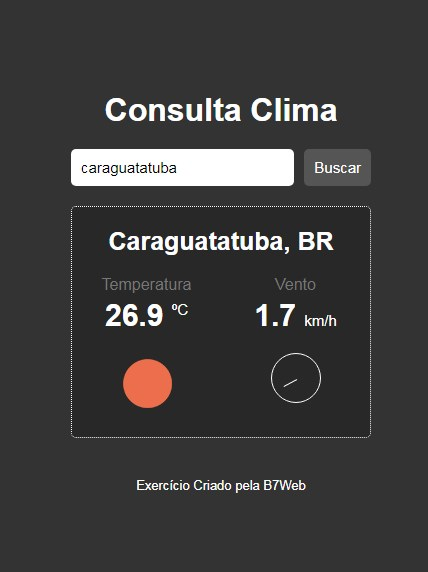

<h1 align="center">
  Consulta Clima
</h1>

## 📋 Índice

- [Preview](#-Preview)
- [Sobre](#-Sobre)
- [Tecnologias utilizadas](#-Tecnologias-utilizadas)
- [Como executar o projeto](#-Como-executar-o-projeto)

---

## 🖥 Preview

  

---

## 📖 Sobre 

Neste projeto pode ser feito um formulário para consulta de clima de cidades utilizando a API do https://openweathermap.org/ usando a manipulação do JSON para preencher as informações da tela, atividade feita como exercício proposto no curso de JavaScript da b7web do professor Bonieky Lacerda.

---

## 🚀 Tecnologias utilizadas
O projeto está sendo desenvolvido com as seguintes tecnologias:
- HTML5
- CSS3
- JavaScript
- API Open Weather

---

## ⌨ Como executar o projeto

Baixe o arquivo .ZIP do projeto e após descompactar abra com seu navegador o arquivo index.html.

---

